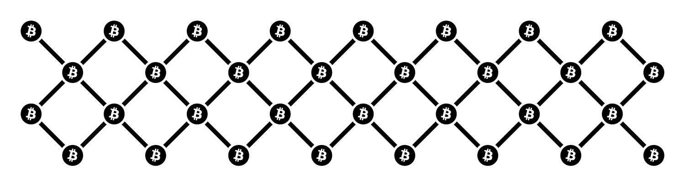
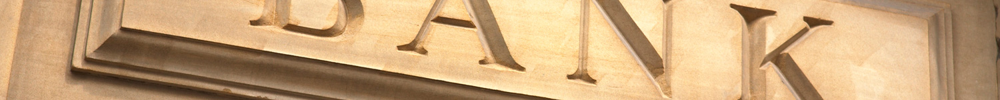

title: Bitcoin
date: 2014-10-02 10:58:28
updated: 2014-10-02 11:00:00
layout: clean
---

[Wat is Bitcoin?](#wib) · [Geen transactiekosten](#gt) · [Uitbetalen naar je bank](#unub) · [In winkels en online](#iweo) · [Snel, makkelijk en veilig](#smv) · [In goed gezelschap](#igg) · [Hoe kom ik aan bitcoins?](#hkiab) · [Accepteer ook bitcoins](#aob) · [Blijf op de hoogte](#bodh) · [Meer informatie](#mi)

---

#### Wat is Bitcoin?

Bitcoin is een compleet digitale vorm van een munteenheid. Wat email deed voor het versturen van brieven, doet bitcoin voor het versturen van geld. Het Bitcoin netwerk wordt aangedreven door haar gebruikers, zonder tussenkomst van banken of overheden. Bitcoin kan ogenblikkelijk veilig verstuurd worden van de ene naar de andere persoon, waar dan ook ter wereld.

Elke transactie wordt opgeslagen in de blokketen. Dat is een gedeeld openbaar register waaruit het hele Bitcoin netwerk is opgebouwd.

---

#### Geen transactiekosten

Momenteel worden er geen kosten gerekend voor het doen van een transactie. Voor een snellere bevestiging van jouw transactie kan de afzender ervoor kiezen om een klein bedrag toe te voegen van $0.05 of €0.04. Zonder extra toevoeging duurt het tot 10 minuten om een transactie te bevestigen. 

---

#### Geen chargebacks

Betalingen met bitcoin zijn onomkeerbaar. Dit betekent dat wanneer een betaling uitgevoerd is, dat deze door zowel de verzender als de ontvanger niet terug te draaien is. Natuurlijk kunnen er nog wel restitutiebetalingen uitgevoerd worden middels een nieuwe transactie.

---

#### Uitbetalen naar je bank

Je kunt ervoor kiezen om betalingen gelijk om te laten zetten in Euros, en deze aan het eind van elke werkdag naar je bank te laten sturen. Je kunt er ook voor kiezen om een deel, of al je omzet in bitcoins te houden.

---

#### In winkels en online

Voor het accepteren van bitcoins zijn er talloze oplossingen om dit zowel in een online winkel te integreren, als in een fysieke locatie door middel van een tablet, smartphone of zelfs met integratie in je huidige betaaloplossing. Voor meer informatie kun je contact met me opnemen via [clients@svdb.co](&#109;&#97;&#105;&#108;&#116;&#111;&#58;&#99;&#108;&#105;&#101;&#110;&#116;&#115;&#64;&#115;&#118;&#100;&#98;&#46;&#99;&#111;).

---

#### Snel, makkelijk en veilig

Het ontvangen van een betaling via Bitcoin is eenvoudig:

1. Je voert het bedrag in en de applicatie genereert een QR code
2. De klant scant de code en verstuurt de betaling
3. De applicatie laat een bevestiging zien zodat je weet dat de betaling is ontvangen

Er zijn verschillende bestaande Point-Of-Sale producten waarmee Bitcoin integreert, o.a. SoftTouch POS. Online is Bitcoin te implementeren in verschillende platforms zoals Wordpress, Shopify, Drupal, Magento, etc.

De veiligheid van Bitcoin wordt gegarandeerd door het gebruik van digitale handtekeningen om de transacties te verifieren. Deze worden geregistreerd in het openbare register, en zorgt ervoor dat er geen dubbele of ongeldige transacties plaatsvinden.

---

#### In goed gezelschap

Bitcoin is nog een nieuwe techniek en in de markt wordt nog volop geinnoveerd. Steeds meer bedrijven accepteren bitcoins als betaalmiddel. Je kunt met bitcoins betalen bij [Stadscafe de Waag](http://www.de-waag.nl/) in Delft, [de Online Drogist](http://www.deonlinedrogist.nl/), eten bestellen bij meer dan 5000 locaties via [Thuisbezorgd](http://www.thuisbezorgd.nl/), bij meer dan 10,000 online winkeliers via [Mollie](https://www.mollie.nl/betaaldiensten/bitcoin/), energieleverancier [BAS](http://www.basnederland.nl/betalen-met-bitcoin-bij-bas/), ruimtevluchten via [Virgin Galactic](http://www.virgin.com/richard-branson/bitcoins-in-space) en hotelboekingen via [Expedia](http://www.expedia.com/Checkout/BitcoinTermsAndConditions).

Hier zijn slechts enkele van de vele andere bedrijven die je zijn voorgegaan met het accepteren van Bitcoin:

---

#### Hoe kom ik aan bitcoins?

Bitcoins zijn te krijgen door het aanbieden van producten of diensten voor bitcoins, of ze zijn te kopen van andere mensen die al bitcoins hebben. Dit kan via online handelsplaatsen als [Bitstamp](http://nl.bitstamp.net/) of [Bitonic](http://www.bitonic.nl/). Hierbij wordt het geld van je rekening afgeschreven en de bitcoins naar je Bitcoin portemonnee gestuurd. Ook kun je bitcoins krijgen via Bitcoin geldautomaten. Op het moment van schrijven zijn er Bitcoin geldautomaten te vinden in Den Haag, Delft, Lelystad, Arnhem, Amsterdam, en hierbij voer je contant geld in en krijg je er bitcoins voor terug.

Ook zijn bitcoins te verdienen door middel van 'mining'. Mining is het proces waarbij gespecialiseerde computers wiskundige puzzels oplossen bij het verwerken van Bitcoin transacties. De oplossingen worden door het netwerk beloond met nieuwe bitcoins.

---

#### Accepteer ook bitcoins!

Wil je ook Bitcoin accepteren in jouw winkel of op je website? Ik kan je verder helpen met de integratie, of verdere uitleg geven hoe het precies werkt. Ik geef lessen over hoe je er in het dagelijks leven mee om kunt gaan, hoe je veilig backups kunt maken van jouw Bitcoin portemonnee, betalingen kunt versturen en ontvangen en het aansluit met je bankrekening.

<form method="POST" action="http://formspree.io/mail@svdb.co">
Ik wil Bitcoin <input id="checkbox_website" type="checkbox" name="where" value="website"><label for="checkbox_website">op mijn website</label><input id="checkbox_store" type="checkbox" name="where" value="store"><label for="checkbox_store">in mijn winkel</label> <input name="name" type="name" placeholder="Naam"><input name="_replyto_" type="email" placeholder="Email"> <textarea name="message" rows="5"placeholder="Vertel me in het kort over je bedrijf"></textarea><input type="text" name="_gotcha" style="display:none" /><button class="btn simple" type="submit">Accepteer Bitcoin</button>
</form>

---

#### Blijf op de hoogte

Ik schrijf een korte, driemaandelijkse nieuwsbrief waarin ik het nieuws in de wereld van Bitcoin meld. Ik behandel je gegevens vertrouwelijk en deel ze onder geen beding met derde partijen. Je krijgt een bevestigingsmailtje, en dan mijn nieuwsbrief elk kwartaal. Je kunt je op elk moment gemakkelijk afmelden.

<form method="POST" action="//svdb.us9.list-manage.com/subscribe/post?u=4d8b2b856485f03e55397607f&amp;id=6bacb1d7a0">
<input name="NAME" type="name" placeholder="Naam"><input name="EMAIL" type="name" placeholder="Email"><input type="hidden" name="_subject" value="New form submission" />
<input type="text" name="b_4d8b2b856485f03e55397607f_6bacb1d7a0" tabindex="-1" value="">
<button type="submit" class="btn simple">Verstuur</button>
</form>

---

#### Meer informatie

Voor veelgestelde vragen, kun je terecht op de [Wiki pagina van bitcoin.org](https://en.bitcoin.it/wiki/FAQ). Voor nieuwsartikelen over bitcoin, kijk [hier](/nieuws). Anders kun je me ook [emailen](&#109;&#97;&#105;&#108;&#116;&#111;&#58;&#109;&#97;&#105;&#108;&#64;&#115;&#118;&#100;&#98;&#46;&#99;&#111;) voor vragen.

<iframe width="1500" height="844" src="//www.youtube.com/embed/Gc2en3nHxA4?rel=0&amp;showinfo=0" frameborder="0" allowfullscreen></iframe>