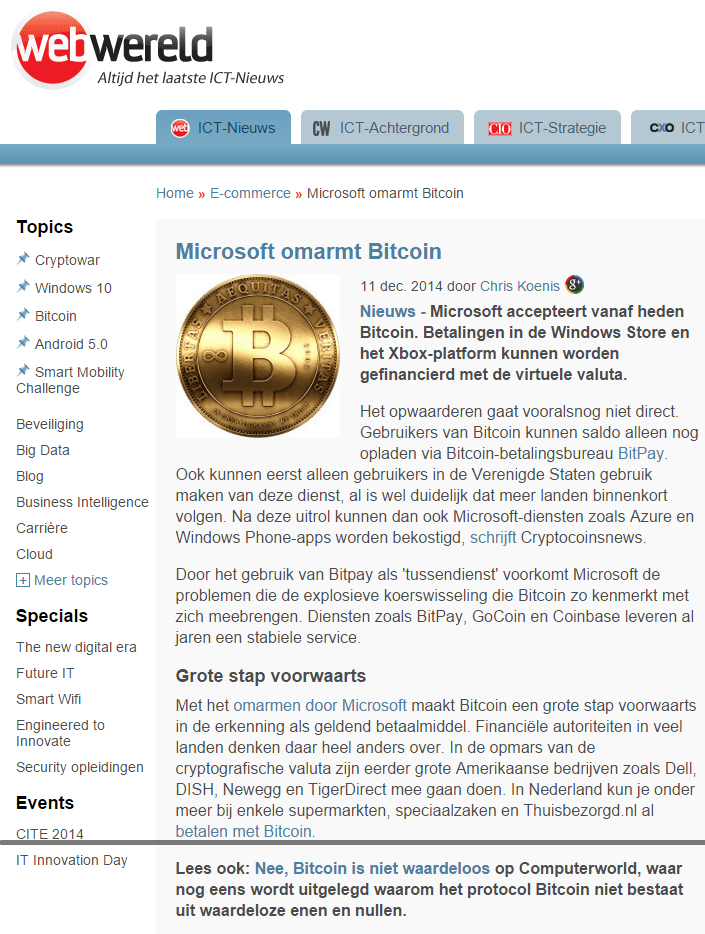
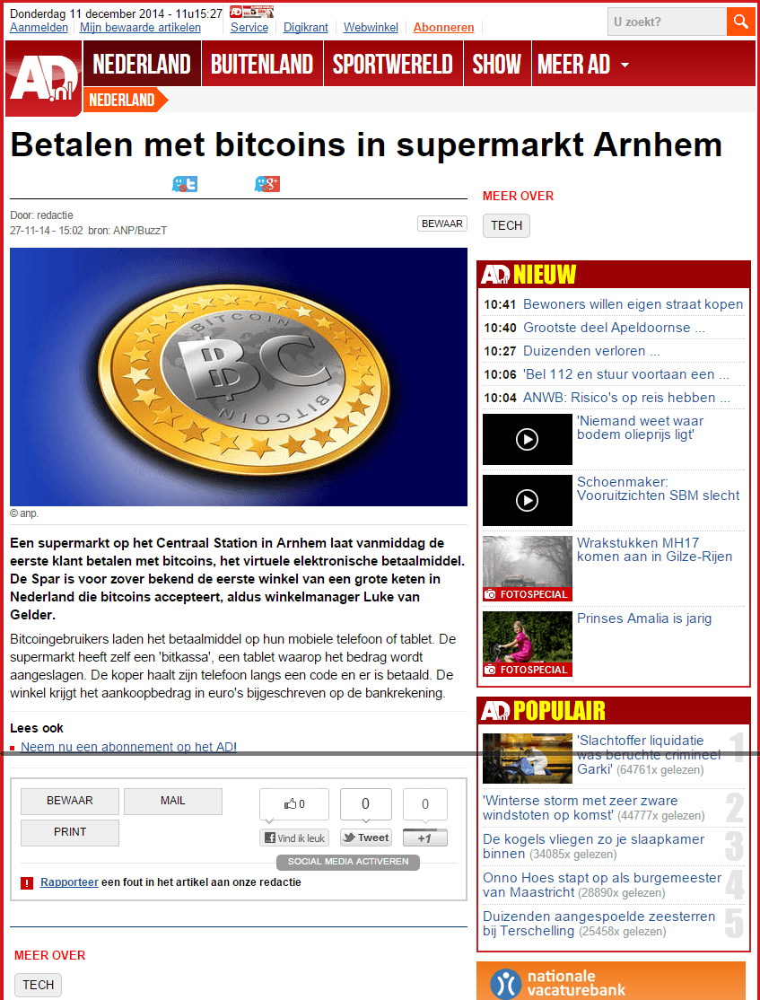
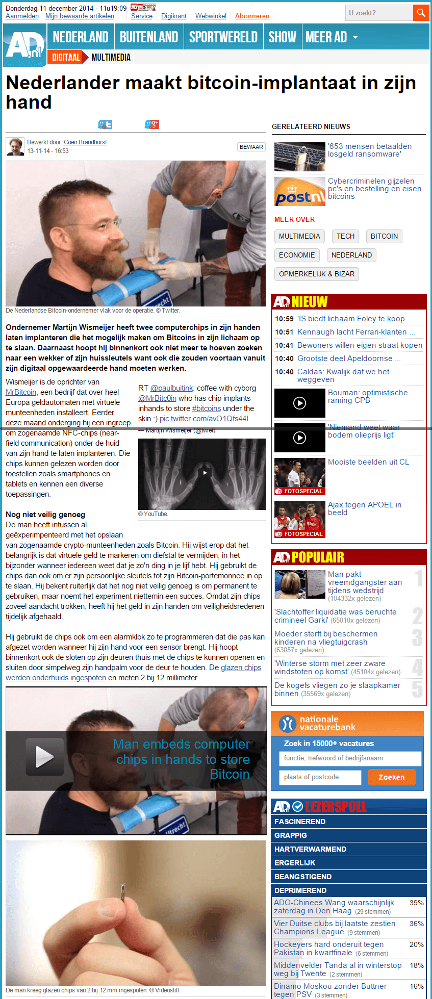
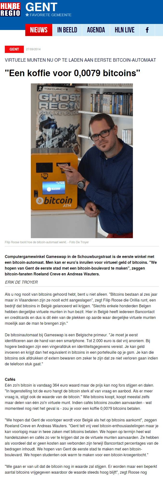
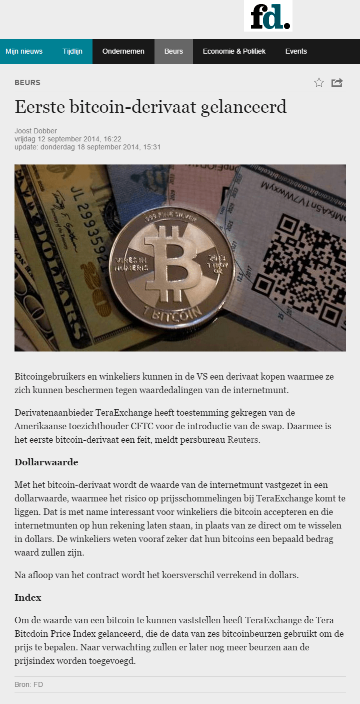
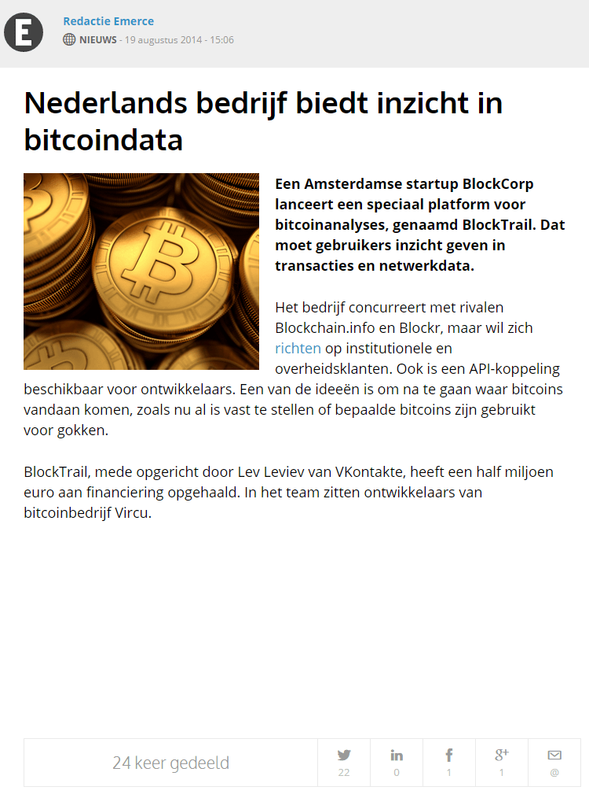
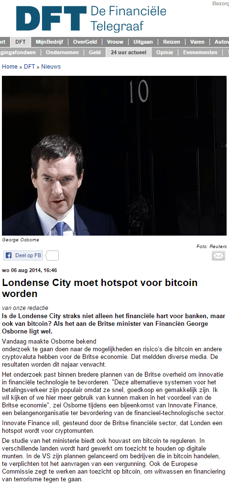
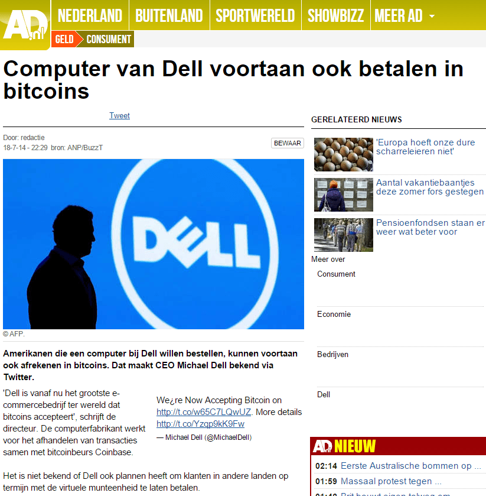
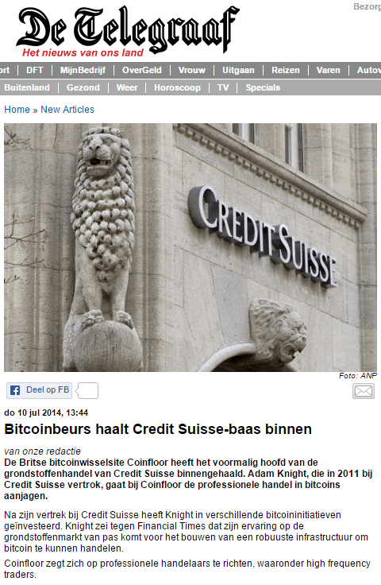

title: Nederlands Bitcoin Nieuws
date: 2014-10-09 01:21:50
updated: 2014-12-11 11:47:50
---

[__WebWereld: "Microsoft omarmt Bitcoin"__](#20141211_ww)
_11 december 2014_

[__Algemeen Dagblad: "Betalen met bitcoins in supermarkt Arnhem"__](#20141114_ad)
_14 november 2014_

[__Algemeen Dagblad: "Nederlander maakt bitcoin-implantaat in zijn hand"__](#20141113_ad)
_13 november 2014_

[__Gelderlander: "Arnhem meest vriendelijke stad voor bitcoingebruiker"__](#20141022_gelderlander)
_22 oktober 2014_

[__De Tijd: "BearWhale, of de London Whale van bitcoin"__](#20141007_detijd)
_7 oktober 2014_

[__Telegraaf: "Geef bitcoin kans"__](#20140921_telegraaf)
_21 september 2014_

[__Het Financieele Dagblad: "Eerst bitcoin-derivaat gelanceerd"__](#20140912_fd)
_12 september 2014_

[__Emerce: "Europa sluit Bitcoin in de armen"__](#20140912_emerce)
_12 september 2014_

[__Emerce: "Nederlands bedrijf biedt inzicht in bitcoindata"__](#20140819_emerce)
_19 augustus 2014_

[__De Financiële Telegraaf: "Londense City moet hotspot voor bitcoin worden"__](#20140806_dft)
_6 augustus 2014_

[__Spits: "Vliegreis ook te betalen met Bitcoins"__](#20140723_spits)
_23 juli 2014_

[__De Financiële Telegraaf: "Dell gaat bitcoin accepteren"__](#20140718_dft)
_18 juli 2014_

[__AD: "Computer van Dell voortaan ook betalen in bitcoins"__](#20140718_ad)
_18 juli 2014_

[__Telegraaf: "Bitcoinbeurs haalt Credit Suisse-baas binnen"__](#20140710_telegraaf)
_10 juli 2014_

[__Telegraaf: "Bitcoin legaal in Californië"__](#20140701_telegraaf)
_1 juli 2014_

[__Volkskrant: "Eerste Bitcoin-automaat van Nederland geopend in Den Haag"__](#20140320_volkskrant)
_20 maart 2014_

[__Volkskrant: "Bitcoin belandt via fonds ook op de beurs"__](#20130927_volkskrant)
_27 september 2013_

__WebWereld: "Microsoft omarmt Bitcoin"__
_11 december 2014_

__Algemeen Dagblad: "Betalen met bitcoins in supermarkt Arnhem"__
_14 november 2014_

__Algemeen Dagblad: "Nederlander maakt bitcoin-implantaat in zijn hand"__
_13 november 2014_

__Gelderlander: "Arnhem meest vriendelijke stad voor bitcoingebruiker"__
_22 oktober 2014_

__De Tijd: "BearWhale, of de London Whale van bitcoin"__
_7 oktober 2014_

__Het Laatste Nieuws: "Een koffie voor 0,0079 bitcoins"__
_27 september 2014_

__Telegraaf: "Geef bitcoin kans"__
_21 september 2014_

__Het Financieele Dagblad: "Eerst bitcoin-derivaat gelanceerd"__
_12 september 2014_

__Emerce: "Europa sluit Bitcoin in de armen"__
_12 september 2014_

__Emerce: "Nederlands bedrijf biedt inzicht in bitcoindata"__
_19 augustus 2014_

__De Financiële Telegraaf: "Londense City moet hotspot voor bitcoin worden"__
_6 augustus 2014_

__Spits: "Vliegreis ook te betalen met Bitcoins"__
_23 juli 2014_

__De Financiële Telegraaf: "Dell gaat bitcoin accepteren"__
_18 juli 2014_

__AD: "Computer van Dell voortaan ook betalen in bitcoins"__
_18 juli 2014_

__Telegraaf: "Bitcoinbeurs haalt Credit Suisse-baas binnen"__
_10 juli 2014_

__Telegraaf: "Bitcoin legaal in Californië"__
_1 juli 2014_

__Volkskrant: "Eerste Bitcoin-automaat van Nederland geopend in Den Haag"__
_20 maart 2014_

__Volkskrant: "Bitcoin belandt via fonds ook op de beurs"__
_27 september 2013_

<a class="btn big-button" href="mailto:mail@svdb.co">Stuur nieuws in</a>

